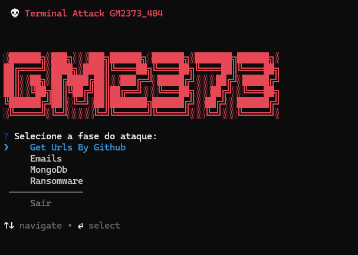

(# AttackMenu — Terminal Attack GM2373_404)



Aviso: este repositório contém ferramentas de auditoria, coleta e teste de credenciais e utilitários que podem ser abusados para atividades maliciosas (coleta de variáveis de repositórios públicos, validação SMTP, verificação de URIs MongoDB e rotinas de bloqueio). Use apenas em ambientes de teste controlados e com autorização explícita. O autor não se responsabiliza por uso indevido.

## Resumo

`AttackMenu` é uma ferramenta de linha de comando/interativa escrita em TypeScript/Node.js que provê um terminal com interface (menu) para automatizar tarefas de segurança ofensiva/avaliação, incluindo:

- Raspagem de código no GitHub buscando variáveis sensíveis (ex.: URIs do MongoDB, credenciais de e-mail).
- Validação de URIs MongoDB (teste de conexão, coleta de hits válidos).
- Validação e verificação de credenciais de e-mail via SMTP (teste e envio limitado).
- Dump de bases MongoDB quando permissões permitem.
- Fluxos experimentais de bloqueio/`ransomware` aplicados a URIs MongoDB (destinado apenas a pesquisa e teste em ambientes controlados).

O terminal oferece menus para orquestrar esses fluxos, permitir coleta automática (GitHub -> validação) e operações em massa.

## Tecnologias principais

- Node.js + TypeScript
- Puppeteer + puppeteer-extra-plugin-stealth
- MongoDB native driver
- nodemailer, imapflow (e-mail)
- inquirer / @inquirer/prompts (interface interativa)

## Arquivos e módulos importantes

- `menu.ts` — ponto de entrada e menu interativo.
- `src/GitHubScraper.ts` — scraper para buscas de código no GitHub.
- `src/mongoDb.ts` — mecanismo de extração e validação de URIs (`CredentialEngine`).
- `src/commands/Emails.ts` — fluxo de coleta/validação/envio/escuta de e-mails.
- `src/commands/dump.ts` — lógica de dumpeamento de bancos e coleções.
- `src/commands/MongoManager.ts` — gerenciador de URIs persistidas e ações (dump, ransomware flow).
- `src/commands/ransomwareRunner.ts` — orquestra operações massivas de `lock` (pesquisa/estudo).
- `src/utils` — utilitários auxiliares (coleta, listener, cryp, limpeza, etc.).

## Instalação rápida

1. Instale dependências:

```bash
npm install
```

2. Executar o menu diretamente com `npx tsx` (sem compilar) ou via `npm run start`:

```bash
npx tsx menu.ts
# ou
npm run start
```

## Uso e recomendações

- O menu (`menu.ts`) expõe opções para `Emails`, `MongoDb`, `Ransomware` e `Get Urls By Github`.
- Evite executar fluxos de `ransomware` ou testes em sistemas que você não possui ou não tem permissão explícita.
- Para scraping no GitHub, é necessário configurar cookies de sessão (variáveis de ambiente `COOKIE_GIT0`, `COOKIE_GIT1`, etc.) para evitar bloqueios ou limitações.

## Segurança e ética

Este projeto contém funcionalidades que, se usadas sem autorização, são ilegais e antiéticas. Só use em laboratórios privados, máquinas de teste e com consentimento explícito dos proprietários dos sistemas alvo.

## Contribuição

Melhorias bem-vindas: documentação adicional, testes unitários, modularização das partes sensíveis e mecanismos de consentimento/autenticação quando aplicável.

---
Arquivo gerado automaticamente a partir da inspeção do código-fonte.

